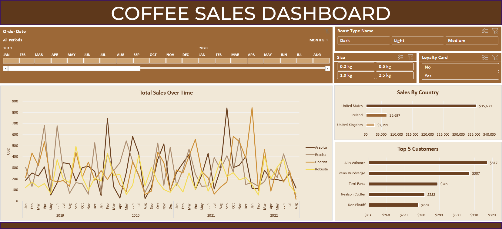

# ☕ Coffee Sales Dashboard (Excel Project)

This project outlines the end-to-end creation of a **dynamic, interactive Coffee Sales Dashboard** built entirely in **Microsoft Excel**. The process covers data gathering, transformation, and visualization using pivot tables, pivot charts, timelines, and slicers.

The ultimate goal of this dashboard is to provide analysts and stakeholders with clear, actionable insights into coffee sales performance over time, geographical distribution, and key customer segments.

---

## 📈 Dashboard Preview

---

## ✨ Key Features & Visualizations

The final dashboard is packed with insightful components, all seamlessly connected and interactive:

* **Total Sales Over Time:** A compelling line chart visualizing monthly sales trends, meticulously segmented by the four distinct coffee types (Arabica, Excelsa, Liberica, Robusta).
* **Sales By Country:** A clear horizontal bar chart showcasing sales distribution across the three primary markets (U.S., Ireland, UK).
* **Top 5 Customers:** A focused bar chart highlighting the most valuable customers based on their total sales volume.
* **Interactive Filters:** Empowering users to explore data dynamically:
    * **Timeline:** 🗓️ Effortlessly filter all visuals by specific time periods (Year/Month).
    * **Slicers:** 🏷️ Enable quick, intuitive filtering based on:
        * **Roast Type Name:** (Dark, Light, Medium)
        * **Size:** (0.2kg, 0.5kg, 1.0kg, 2.5kg)
        * **Loyalty Card:** (Yes/No)

---

## 🛠️ Technologies & Tools

This project leverages the robust capabilities of:

* **Microsoft Excel:** The core platform for all data manipulation, analysis, and visualization.
* **Formulas:** Advanced Excel functions like `XLOOKUP`, `INDEX MATCH`, and nested `IF` statements for sophisticated data transformation.
* **Tools:** Efficient use of Pivot Tables, Pivot Charts, Timelines, and Slicers for powerful reporting.

---

## ⚙️ Project Walkthrough (Step-by-Step)

Follow this detailed data pipeline process to understand the dashboard's construction:

### 1. Data Gathering & Transformation 🚀

* **Data Structure:** The journey begins with three distinct data sheets: `Orders`, `Customers`, and `Products`.
* **Data Lookup:**
    * `XLOOKUP` was employed to seamlessly integrate customer information (Name, Email, Country, Loyalty Card status) from the `Customers` sheet into the main `Orders` sheet.
    * The powerful `INDEX MATCH` combination dynamically retrieved all product details (Coffee Type, Roast Type, Size, Unit Price) from the `Products` sheet using a single, efficient formula.
* **Calculated Fields:** The crucial **Sales** column was derived by multiplying `Unit Price` by `Quantity Sold`.
* **Data Cleaning:** Nested `IF` functions were used to convert abbreviations (e.g., 'rob' to 'Robusta', 'M' to 'Medium') into full, user-friendly names for Coffee Type and Roast Type.
* **Formatting:** Custom date (`dd-mmm-yyyy`) and number formatting (USD currency, size in `0.0 kilo`) were applied for clarity.
* **Table Conversion:** The raw data range was transformed into an official Excel **Table** (dubbed `Orders Table`) to ensure pivot tables automatically incorporate any new data additions (e.g., the Loyalty Card column).

### 2. Analysis and Visualization Setup 📈

* **Pivot Table Creation:** The analytical foundation was laid by creating the first pivot table (`Total Sales`), utilizing the quick `Alt + N + V + T` shortcut.
* **Grouping:** The `Order Date` field was intelligently grouped by **Years and Months** for effective time-series analysis.
* **Pivot Chart Creation:**
    * **Total Sales:** The primary **Line Chart** was constructed using `Order Date` (Rows), `Coffee Type Name` (Columns), and `Sum of Sales` (Values).
    * **Sales by Country:** A compelling **Bar Chart** was generated using `Country` and `Sum of Sales`, then sorted by sales amount (ascending) to highlight top performers.
    * **Top 5 Customers:** A precise **Value Filter (Top 10... -> Top 5)** was applied to the `Customer Name` field to focus on key customer segments, forming the corresponding Bar Chart.
* **Styling:** A custom, coffee-themed color scheme (deep browns and warm accents) was applied, and field buttons were hidden for a polished, clean look.

### 3. Interactivity and Dashboard Finalization 💡

* **Inserting Controls:** A **Timeline** (linked to `Order Date`) and three insightful **Slicers** (`Roast Type Name`, `Size`, `Loyalty Card`) were integrated. The Loyalty Card column was automatically included after refreshing the pivot table data source.
* **Connecting Controls:** The powerful **Report Connections** feature was utilized for the Timeline and all Slicers, ensuring they filter **all three pivot tables/charts simultaneously**, creating a truly dynamic and responsive dashboard.
* **Layout:** The final **Dashboard** sheet was meticulously crafted with a clean header and background. All charts, the timeline, and the slicers were then cut (`Ctrl+X`) and precisely pasted (`Ctrl+V`) onto the canvas, with sizes and positions adjusted for optimal viewing.

---

## 🚀 Getting Started

Ready to explore or recreate this project? Follow these simple steps:

1.  ⬇️ Download the `coffeeOrdersRawData.xlsx` sample data file.
2.  💻 Follow the comprehensive steps outlined in the Project Walkthrough.
